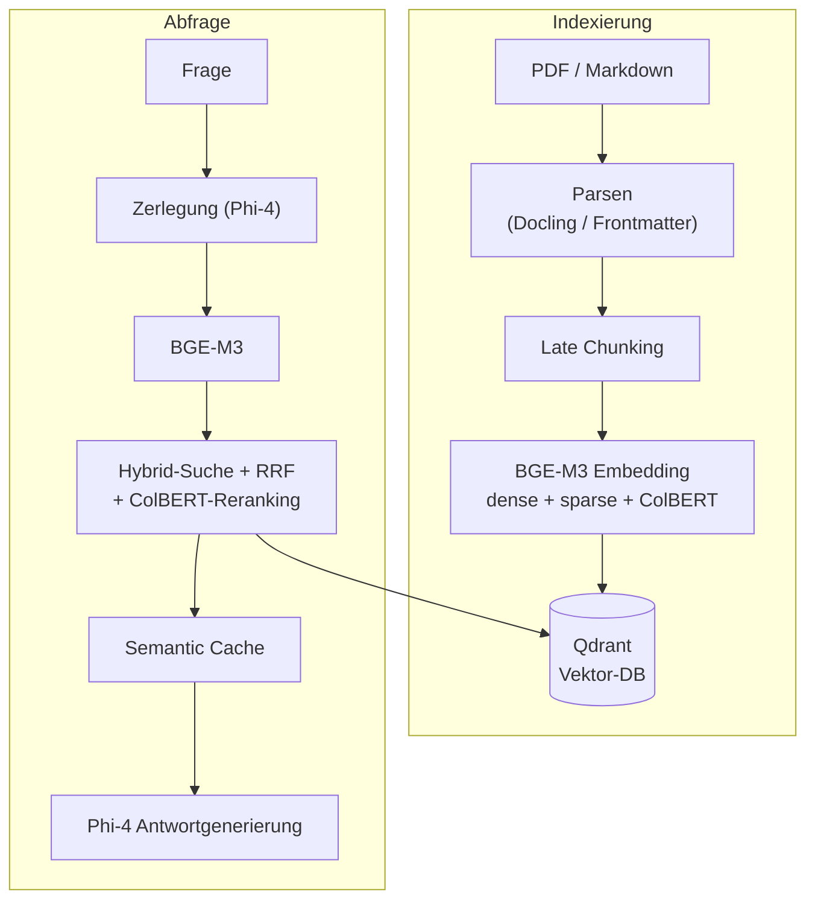
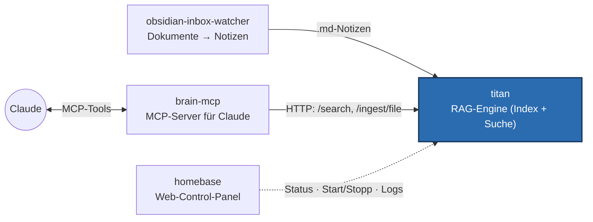

# titan

**Lokales RAG-System auf einer einzelnen Workstation: indexiert PDFs und
Markdown-Notizen multi-vektoriell und beantwortet Fragen in natürlicher Sprache
mit hybrider Suche + lokalem LLM — vollständig offline, ohne Cloud und ohne API-Keys.**

titan ist die Such- und Retrieval-Engine eines kleinen, aus vier Diensten
bestehenden Wissenssystems (siehe [Teil eines größeren Systems](#teil-eines-größeren-systems)).

## Was ist RAG — und was hier besonders ist

**RAG** (Retrieval-Augmented Generation) heißt: Statt ein Sprachmodell frei
„aus dem Gedächtnis" antworten zu lassen, werden zuerst die *relevanten*
Textstellen aus einer eigenen Dokumentensammlung gesucht und dem Modell als
Kontext mitgegeben. Die Antwort ist dadurch belegbar und aktuell.

Das Besondere an titan: Es läuft **komplett lokal** auf einer einzelnen GPU —
kein OpenAI, kein Pinecone, keine Daten verlassen die Maschine. Statt einer
einfachen Vektorsuche kombiniert es **drei** Retrieval-Signale pro Textstück
(dichte, lexikalische und Token-genaue Ähnlichkeit) und führt sie über Reciprocal
Rank Fusion zusammen — der entscheidende Qualitätshebel in einer RAG-Pipeline.

## Architektur



**Kernbausteine:**

- **BGE-M3 Multi-Vektor-Embeddings** — drei Vektoren pro Chunk (dense + sparse +
  ColBERT), statt nur einem. Deckt semantische, lexikalische und Token-genaue
  Treffer ab.
- **Late Chunking** — bettet den *gesamten* Dokumentkontext ein, bevor in Chunks
  zerlegt wird, und erhält so die Bedeutung über Chunk-Grenzen hinweg.
- **Hybrid Search mit Reciprocal Rank Fusion + ColBERT-MaxSim-Reranking** —
  drei Rankings werden zu einem konsolidierten Ergebnis zusammengeführt.
- **Phi-4 via Ollama** — zerlegt komplexe Fragen und generiert Antworten,
  vollständig lokal.
- **Qdrant** als Vektordatenbank (lokal, gRPC).
- **FastAPI-Service** mit dauerhaft im VRAM gehaltenem Modell und einem
  fcntl-basierten GPU-Lock, sodass kein Modell-Reload pro Anfrage nötig ist.
- **Semantic Cache** für wiederkehrende Anfragen und **LLM-as-Judge-Evaluation**
  (RAG-Triade) zur Qualitätsmessung.
- **Robuste Neuindexierung** nach dem Prinzip *upsert-before-delete* (pro Lauf
  eine `run_id`): alte Chunks werden atomar ersetzt, nie dupliziert, und ein
  Absturz mitten im Update lässt den alten Stand durchsuchbar.

## Beispiel

Der Service läuft auf `127.0.0.1:8765` und wird über HTTP angesprochen:

```bash
curl -s localhost:8765/search -H 'content-type: application/json' -d '{
  "query": "Wie funktioniert Late Chunking?",
  "domain": "titan",
  "top_k": 3
}'
```

```jsonc
{
  "results": [
    {
      "text": "Late Chunking bettet den vollständigen Dokumentkontext ein, bevor …",
      "source_path": "/vault/notes/rag/late-chunking.md",
      "domain": "titan",
      "score": 0.83
    }
    // … weitere Treffer, absteigend nach Score
  ]
}
```

Per CLI lässt sich Suche und Antwortgenerierung verketten:

```bash
python -m titan.search "Wie funktioniert Late Chunking?" --json | python -m titan.generate
```

## Teil eines größeren Systems

titan ist der **RAG-Kern**. Zwei Schwester-Repos hängen davor und dahinter, ein
drittes steuert das Ganze:



- **[obsidian-inbox-watcher](https://github.com/charlieLucke/obsidian-inbox-watcher)** —
  verwandelt eingeworfene PDFs/DOCX/URLs mit einem LLM in strukturierte
  Markdown-Notizen (das Dokument-Frontend).
- **titan** *(du bist hier)* — indexiert die Notizen und beantwortet Suchanfragen.
- **[brain-mcp](https://github.com/charlieLucke/brain-mcp)** — bindet titan als
  MCP-Server an Claude an (überwacht den Vault, stellt Such-Tools bereit).
- **[homebase](https://github.com/charlieLucke/homebase)** — das Web-Control-Panel:
  Status, Logs und Start/Stopp der Dienste. Steht daneben, nicht im Datenpfad.

## Stack

- **Sprache:** Python 3.12+ · **Paketmanager:** uv
- **Embeddings:** BGE-M3 via FlagEmbedding (dense + sparse + colbert)
- **LLM:** Phi-4 via Ollama (lokal, kein API-Key)
- **Vektor-DB:** Qdrant (lokal, gRPC-Port 6334)
- **PDF-Parsing:** Docling
- **API:** FastAPI (Service auf `127.0.0.1:8765`)
- **GPU:** NVIDIA (~16 GB VRAM), serialisiert über ein fcntl-Lock (`/tmp/bge_m3.lock`)

## Voraussetzungen

- Eine NVIDIA-GPU mit einem CUDA-fähigen `torch`-Build (das standardmäßige
  `uv`-Wheel ist CPU-only — prüfen mit
  `uv run python -c "import torch; print(torch.cuda.is_available())"`).
- Eine laufende **Qdrant**-Instanz (lokal, gRPC `6334`) und **Ollama**, das Phi-4
  bereitstellt.
- WSL2-Nutzer: systemd in `/etc/wsl.conf` aktivieren (`[boot]\nsystemd=true`).

## Einrichtung

Erfordert [uv](https://docs.astral.sh/uv/) und Python 3.12+.

```bash
make install                       # Abhängigkeiten + pre-commit-Hooks
uv run python -m titan.tools.init_col   # Qdrant-Collection anlegen
```

`.env.example` nach `.env` kopieren und `QDRANT_*`, `COLLECTION_NAME`,
`OLLAMA_URL`/`OLLAMA_MODEL`, `INGEST_BASE_DIR`, `VAULT_ROOT` sowie die
Cache-Einstellungen nach Bedarf anpassen. `VAULT_ROOT` / `INGEST_BASE_DIR` können
beliebige Verzeichnisse sein — die Defaults in `.env.example` (`/mnt/f/...`) sind
Beispiele aus dem WSL2-Setup des Autors; auf einem nativen Linux-System Pfade
unterhalb des Home-Verzeichnisses verwenden.

## Service starten

```bash
uv run python -m titan service            # API auf Port 8765 starten
uv run python -m titan service --port 9000  # alternativer Port
curl localhost:8765/health                # Health-Check
```

Im Deployment läuft er als systemd-User-Service (`titan-service`); siehe `deploy/`.

### HTTP-API

| Methode & Pfad | Zweck |
|---|---|
| `GET /health` | Service-Status: BGE-M3 geladen, Qdrant erreichbar, VRAM-Auslastung. |
| `POST /search` | Hybride Suche: Query-Zerlegung → BGE-M3 → RRF → Semantic Cache. |
| `POST /ask` | Volles RAG: Retrieval (wie `/search`) → Phi-4 formuliert eine belegte Antwort. |
| `POST /ingest/file` | Eine Markdown-Datei indexieren (upsert-before-delete via `run_id`). |
| `GET /domains` | Alle Domains im Index mit Chunk-Anzahl. |
| `GET /notes` | Alle indexierten Notizen, gruppiert nach Quellpfad, mit Domain + Chunk-Anzahl. |
| `GET /reports/graph_check` | Link-Graph: tote Links, verwaiste Notizen, meistverlinkte. Derselbe Bericht wie `python -m titan.tools.graph_check --json`. |
| `GET /reports/offene_punkte` | Offene Punkte aus allen Notizen, älteste zuerst. `?ideen=true` sammelt stattdessen die „Ideen"-Abschnitte. |
| `POST /find_related` | Notizen, die einer gegebenen Notiz semantisch ähnlich sind. |
| `DELETE /chunks` | Alle Chunks einer Datei entfernen (nach `source_path`). |

## Entwicklung

```bash
make test       # Tests mit Coverage ausführen
make test-fast  # langsame + Integrationstests überspringen
make check      # vollständiges Quality-Gate: Lint + Typen + Tests
make format     # Style-Probleme automatisch beheben
make help       # alle verfügbaren Befehle auflisten

uv run pytest tests/integration/ -m integration -v   # Integrationstests (benötigen einen laufenden Service)
```

## Projektstruktur

```
src/titan/
├── main.py            # Dispatcher: python -m titan service | help
├── ingest.py          # Parsen → Late Chunking → BGE-M3 Embedding → Qdrant-Upsert
├── search.py          # Query-Zerlegung, BGE-M3, RRF, Semantic Cache
├── generate.py        # Phi-4 Antwortgenerierung aus Chunk-Kontext
├── evaluate.py        # LLM-as-Judge-Evaluation
├── service/           # FastAPI-App, State-Singleton, Schemas, Routes
├── eval/              # A/B-Evaluations-Tool + Fixtures
└── tools/init_col.py  # Qdrant-Collection-Setup
deploy/                # systemd-Service-Unit + Installationsanleitung
tests/{titan,integration}/   # Unit- + Service-Integrationstests
docs/ai/               # Architektur, Entscheidungen und Pläne
.github/workflows/     # CI-Konfiguration
```

## Tooling

| Tool         | Zweck                                |
|--------------|--------------------------------------|
| **uv**       | Paketmanager + Python-Installer      |
| **ruff**     | Linter + Formatter                   |
| **mypy**     | Statischer Typprüfer (Strict Mode)   |
| **pytest**   | Test-Runner mit Coverage             |
| **pre-commit** | Git-Hook-Runner                    |

Alle Tools laufen bei jedem Push in der CI.

## Dokumentation & Entwickler-Workflow

Vertiefende Architektur- und Designentscheidungen liegen in
[`docs/ai/`](docs/ai/) (Architektur, Entscheidungs-Log, Pläne). Diese Dateien
dienen zugleich einem strukturierten KI-gestützten Entwicklungsworkflow: ein
Reasoning-Modell schreibt Pläne nach `docs/ai/plans/`, ein günstigeres Modell
implementiert sie; `CLAUDE.md` (gespiegelt als `AGENTS.md`/`GEMINI.md`) ist der
Einstiegspunkt für jeden Agenten.


## Lizenz

MIT — siehe [LICENSE](LICENSE).
