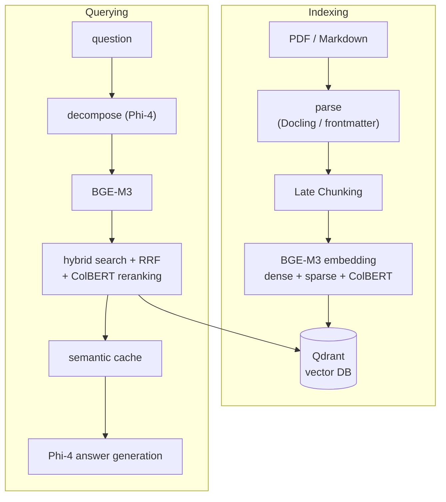
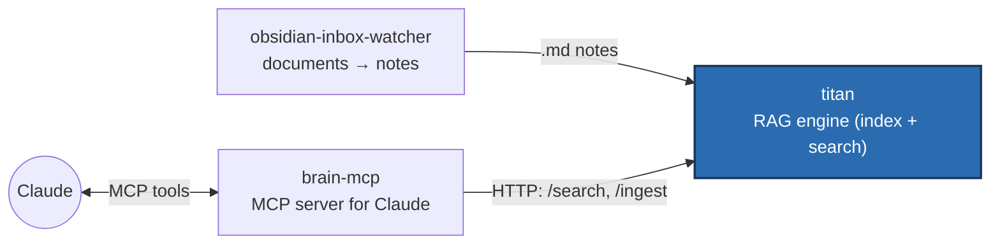

# titan

**A local RAG system on a single workstation: it indexes PDFs and Markdown notes
multi-vectorially and answers natural-language questions with hybrid search + a
local LLM — fully offline, no cloud, no API keys.**

titan is the search-and-retrieval engine of a small, three-service knowledge
system (see [Part of a larger system](#part-of-a-larger-system)).

## What is RAG — and what's special here

**RAG** (Retrieval-Augmented Generation) means: instead of letting a language
model answer freely "from memory", you first retrieve the *relevant* passages
from your own document collection and hand them to the model as context. The
answer becomes grounded and current.

What makes titan special: it runs **entirely locally** on a single GPU — no
OpenAI, no Pinecone, no data ever leaves the machine. Instead of a plain vector
search it combines **three** retrieval signals per chunk (dense, lexical and
token-level similarity) and fuses them via Reciprocal Rank Fusion — the decisive
quality lever in a RAG pipeline.

## Architecture



**Core building blocks:**

- **BGE-M3 multi-vector embeddings** — three vectors per chunk (dense + sparse +
  ColBERT) instead of just one. Covers semantic, lexical and token-level matches.
- **Late Chunking** — embeds the *full* document context before splitting into
  chunks, preserving meaning across chunk boundaries.
- **Hybrid search with Reciprocal Rank Fusion + ColBERT MaxSim reranking** —
  three rankings are consolidated into one result.
- **Phi-4 via Ollama** — decomposes complex questions and generates answers,
  fully local.
- **Qdrant** as the vector database (local, gRPC).
- **FastAPI service** with the model kept permanently in VRAM behind an
  fcntl-based GPU lock, so no per-request model reload is needed.
- **Semantic cache** for recurring queries and **LLM-as-judge evaluation**
  (RAG triad) for quality measurement.
- **Robust re-indexing** via *upsert-before-delete* (one `run_id` per run): old
  chunks are replaced atomically, never duplicated, and a crash mid-update leaves
  the old state searchable.

## Example

The service runs on `127.0.0.1:8765` and is queried over HTTP:

```bash
curl -s localhost:8765/search -H 'content-type: application/json' -d '{
  "query": "How does Late Chunking work?",
  "domain": "titan",
  "top_k": 3
}'
```

```jsonc
{
  "results": [
    {
      "text": "Late Chunking embeds the full document context before …",
      "source_path": "/vault/notes/rag/late-chunking.md",
      "domain": "titan",
      "score": 0.83
    }
    // … more hits, descending by score
  ]
}
```

Via the CLI, search and answer generation can be chained:

```bash
python -m titan.search "How does Late Chunking work?" --json | python -m titan.generate
```

## Part of a larger system

titan is the **RAG core**. Two sibling repos sit in front of and behind it:



- **[obsidian-inbox-watcher](https://github.com/charlieLucke/obsidian-inbox-watcher)** —
  turns dropped PDFs/DOCX/URLs into structured Markdown notes with an LLM (the
  document front end).
- **titan** *(you are here)* — indexes the notes and answers search queries.
- **[brain-mcp](https://github.com/charlieLucke/brain-mcp)** — connects titan to
  Claude as an MCP server (watches the vault, exposes search tools).

## Stack

- **Language:** Python 3.12+ · **Package manager:** uv
- **Embeddings:** BGE-M3 via FlagEmbedding (dense + sparse + colbert)
- **LLM:** Phi-4 via Ollama (local, no API key)
- **Vector DB:** Qdrant (local, gRPC port 6334)
- **PDF parsing:** Docling
- **API:** FastAPI (service on `127.0.0.1:8765`)
- **GPU:** NVIDIA (~16 GB VRAM), serialized with an fcntl lock (`/tmp/bge_m3.lock`)

## Prerequisites

- An NVIDIA GPU with a CUDA-enabled `torch` build (the default `uv` wheel is
  CPU-only — verify with `uv run python -c "import torch; print(torch.cuda.is_available())"`).
- A running **Qdrant** instance (local, gRPC `6334`) and **Ollama** serving Phi-4.
- WSL2 users: enable systemd in `/etc/wsl.conf` (`[boot]\nsystemd=true`).

## Setup

Requires [uv](https://docs.astral.sh/uv/) and Python 3.12+.

```bash
make install                       # deps + pre-commit hooks
uv run python -m titan.tools.init_col   # create the Qdrant collection
```

Copy `.env.example` to `.env` and adjust `QDRANT_*`, `COLLECTION_NAME`,
`OLLAMA_URL`/`OLLAMA_MODEL`, `INGEST_BASE_DIR`, `VAULT_ROOT`, and the cache
settings as needed. `VAULT_ROOT` / `INGEST_BASE_DIR` can be any directory — the
defaults in `.env.example` (`/mnt/f/...`) are examples from the author's WSL2
setup; on a native Linux box use paths under your home.

## Running the service

```bash
uv run python -m titan service            # start the API on port 8765
uv run python -m titan service --port 9000  # alternative port
curl localhost:8765/health                # health check
```

In deployment it runs as a systemd user service (`titan-service`); see `deploy/`.

### HTTP API

| Method & path | Purpose |
|---|---|
| `GET /health` | Service status: BGE-M3 loaded, Qdrant reachable, VRAM usage. |
| `POST /search` | Hybrid search: query decompose → BGE-M3 → RRF → semantic cache. |
| `POST /ingest/file` | Index a Markdown file (upsert-before-delete via `run_id`). |
| `GET /domains` | All domains in the index with chunk counts. |
| `GET /notes` | All indexed notes grouped by source path, with domain + chunk count. |
| `POST /find_related` | Notes semantically similar to a given note. |
| `DELETE /chunks` | Remove all chunks of a file (by `source_path`). |

## Development

```bash
make test       # run tests with coverage
make test-fast  # skip slow + integration tests
make check      # full quality gate: lint + types + tests
make format     # auto-fix style issues
make help       # list all available commands

uv run pytest tests/integration/ -m integration -v   # integration tests (need a live service)
```

## Project Structure

```
src/titan/
├── main.py            # Dispatcher: python -m titan service | help
├── ingest.py          # Parse → Late Chunking → BGE-M3 embed → Qdrant upsert
├── search.py          # Query decompose, BGE-M3, RRF, semantic cache
├── generate.py        # Phi-4 answer generation from chunk context
├── evaluate.py        # LLM-as-judge evaluation
├── service/           # FastAPI app, state singleton, schemas, routes
├── eval/              # A/B evaluation tool + fixtures
└── tools/init_col.py  # Qdrant collection setup
deploy/                # systemd service unit + install guide
tests/{titan,integration}/   # unit + service-integration tests
docs/ai/               # architecture, decisions and plans
.github/workflows/     # CI configuration
```

## Tooling

| Tool         | Purpose                              |
|--------------|--------------------------------------|
| **uv**       | Package manager + Python installer   |
| **ruff**     | Linter + formatter                   |
| **mypy**     | Static type checker (strict mode)    |
| **pytest**   | Test runner with coverage            |
| **pre-commit** | Git hook runner                    |

All tools run in CI on every push.

## Documentation & developer workflow

In-depth architecture and design decisions live in [`docs/ai/`](docs/ai/)
(architecture, decision log, plans). These files also drive a structured
AI-assisted development workflow: a reasoning model writes plans to
`docs/ai/plans/`, a cheaper model implements them; `CLAUDE.md` (mirrored as
`AGENTS.md`/`GEMINI.md`) is the entry point for any agent.

🇩🇪 Eine deutsche Fassung dieser README gibt es unter [README.de.md](README.de.md).

## License

MIT — see [LICENSE](LICENSE).
